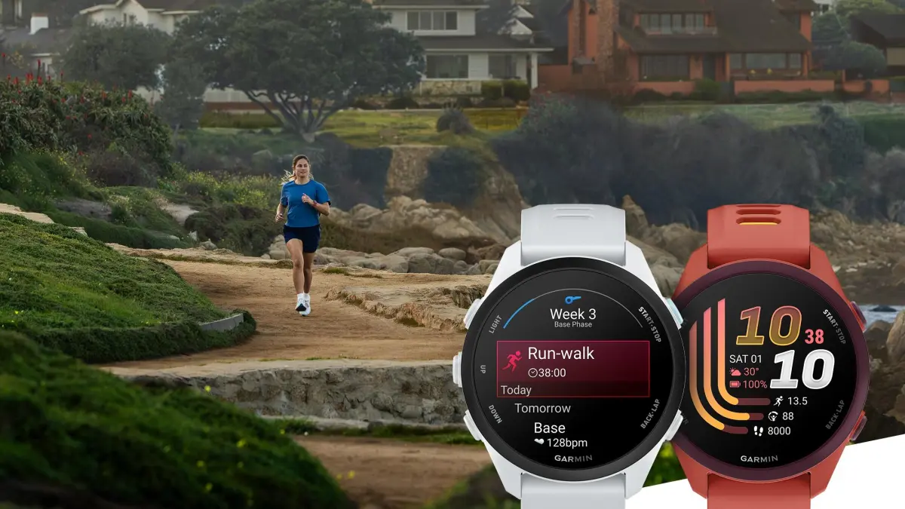
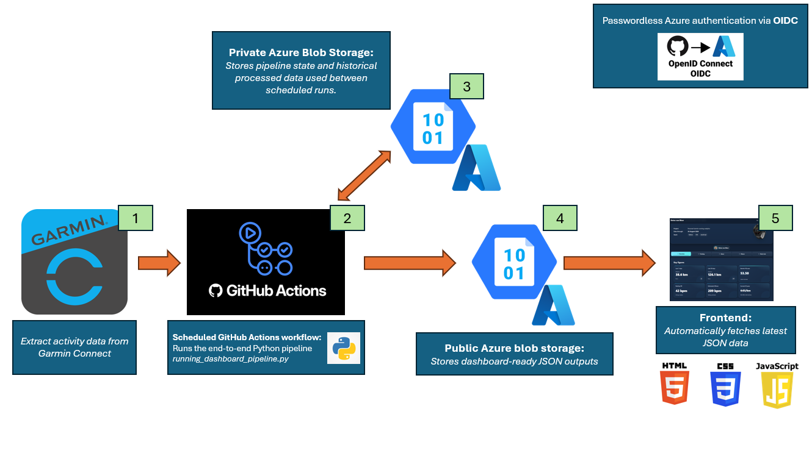

# Garmin Running Insights

An automated data pipeline that transforms Garmin Connect activity data into my own running dashboard.



## Project overview

The pipeline retrieves Garmin activity data, maintains historical pipeline state, processes and analyzes new activities, and publishes dashboard-ready outputs to Azure Blob Storage.
The public data is consumed by a separate HTML/CSS/JavaScript frontend hosted through my personal website.

## Architecture



The workflow consists of five main components:

1. **Garmin Connect** — Activity data is extracted from Garmin Connect.
2. **GitHub Actions** — A scheduled workflow runs the end-to-end Python pipeline.
3. **Private Azure Blob Storage** — Historical processed data and pipeline state are stored between scheduled runs.
4. **Public Azure Blob Storage** — Dashboard-ready JSON outputs are published for external consumption.
5. **Frontend** — The website automatically fetches the latest JSON data and visualizes the results.

GitHub Actions authenticates to Azure using **OpenID Connect (OIDC)**, avoiding permanent Azure credentials in the workflow.

## End-to-end pipeline

The project deliberately uses a single Python pipeline:

`running_insights_pipeline.py`

The pipeline covers the complete workflow from Garmin extraction to Azure publication:

```text
Restore previous pipeline state
        ↓
Retrieve new Garmin activities
        ↓
Process sessions, laps and records
        ↓
Update historical datasets
        ↓
Calculate analytics
        ↓
Generate dashboard-ready JSON
        ↓
Generate AI training context
        ↓
Persist updated private state
        ↓
Publish public outputs to Azure
```

The pipeline is incremental. Previously processed data is persisted so scheduled runs only need to retrieve and process newly available Garmin data. Intermediate datasets are stored primarily in Parquet, while JSON is used for the published dashboard and AI outputs. 


## Automation

The pipeline runs automatically through a scheduled **GitHub Actions** workflow.

The workflow:

* prepares the Python environment;
* installs the required dependencies;
* authenticates to Azure via OIDC;
* restores private pipeline state;
* runs `running_insights_pipeline.py`;
* uploads updated private state;
* publishes the latest dashboard outputs.

This allows the running dashboard to remain up to date without manually running the pipeline.

## Dashboard and methodology

The visualization layer is maintained as part of my personal website rather than duplicated in this repository.

The website repository is therefore the source of truth for the HTML, CSS and JavaScript frontend.

* **Live dashboard:** [Running dashboard](https://sietse-van-meer.github.io/running-dashboard.html)
* **Frontend source:** [Sietse-van-Meer.github.io](https://github.com/Sietse-van-Meer/Sietse-van-Meer.github.io)

The dashboard also contains the detailed methodology and assumptions behind the analytical metrics, including maximum heart-rate estimation, resting heart rate, heart-rate zones, pace zones, training load and race-performance estimates.

Keeping this documentation with the dashboard avoids maintaining duplicate methodology documentation in multiple repositories.

## AI training context

Alongside the dashboard datasets, the pipeline generates a compact:

`training_context.json`

This output summarizes the most relevant recent training information in a machine-readable format.
It allows an AI assistant to analyze recent training progression and individual workouts without needing to process the complete historical Garmin dataset for every request.

## Technology stack

| Area                 | Technology                |
| -------------------- | ------------------------- |
| Data source          | Garmin Connect            |
| Data processing      | Python, Pandas, NumPy     |
| Storage formats      | Parquet, JSON             |
| Cloud storage        | Azure Blob Storage        |
| Cloud authentication | Microsoft Entra ID / OIDC |
| Automation           | GitHub Actions            |
| Frontend             | HTML, CSS, JavaScript     |
| Version control      | Git / GitHub              |

## Repository structure

```text
Running-Dashboard/
├── .gitignore
├── README.md
├── requirements.txt
├── running_insights_pipeline.py
├── .github/
│   └── workflows/
│       └── update-dashboard.yml
└── images/
    ├── running-dashboard-thumbnail.png
    └── running-dashboard-architecture.png
```

The frontend files are intentionally maintained in the separate website repository to avoid duplicate versions of the same HTML, CSS and JavaScript files.

## Development approach

I designed the analytical methodology, data architecture, automation workflow, Azure setup and dashboard requirements for this project.

AI tooling was used extensively to generate and refactor the Python and frontend implementation. My work focused primarily on defining the methodology and system design, validating the results, testing and integrating the individual components, and developing the project into a working automated pipeline.

The project also serves a nice, practical purpose: I use the resulting dashboard regularly to monitor my own training.

## Installation

Install the required external Python packages with:

```bash
pip install -r requirements.txt
```

Configuration and credentials are supplied through environment variables and GitHub repository secrets rather than stored in the source code.

## Security

No Garmin passwords, Azure storage keys or other credentials are stored in this repository.

Private data, authentication state and intermediate pipeline datasets are stored separately from publicly accessible dashboard outputs.

GitHub Actions uses passwordless Azure authentication through OIDC for automated cloud access.

## Disclaimer

Garmin Connect access in this project relies on unofficial Python tooling and is intended for personal data analysis.

This project is not affiliated with or endorsed by Garmin.
